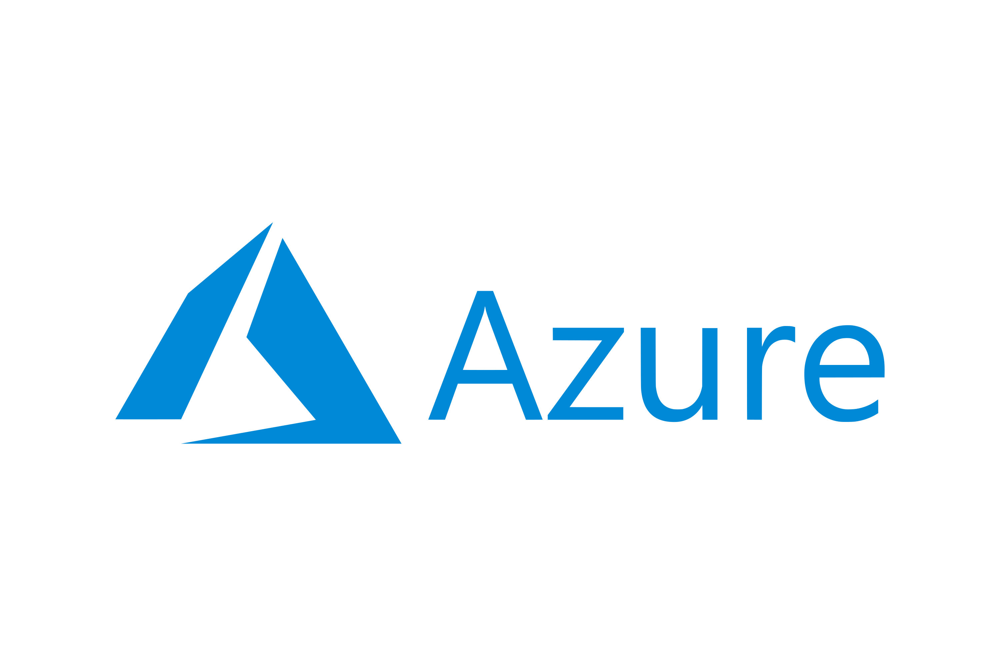

# Benefícios da Nuvem Azure


## 1. **Perguntas e Respostas**

### O que significa SLA e por que é importante nos serviços em nuvem?

- SLA significa Acordo de Nível de Serviço. É um contrato entre o provedor de serviços e o cliente que define o nível esperado de serviço, incluindo tempo de atividade e disponibilidade. Os SLAs são importantes nos serviços em nuvem porque estabelecem expectativas claras em relação ao desempenho, tempo de inatividade e disponibilidade de recursos, garantindo que o provedor atenda aos padrões acordados.

### Como o número de "noves" em um SLA afeta a disponibilidade do serviço?

- Quanto mais "noves" em um SLA, maior a disponibilidade e menor o tempo de inatividade. Por exemplo, um SLA de 99% permite 1,68 horas de inatividade por semana, enquanto um SLA de 99,99% permite apenas 10,1 minutos de inatividade. Cada 'nove' adicional reduz significativamente o tempo de inatividade aceitável, garantindo maior confiabilidade.

### O que você deve considerar ao escolher um SLA para um projeto?

- Ao escolher um SLA, é importante entender os requisitos do projeto, como tempo de inatividade aceitável, orçamento e criticidade dos serviços oferecidos. Para aplicativos de teste ou não críticos, um SLA mais baixo pode ser aceitável, enquanto para ambientes de produção, SLAs mais altos com menos tempo de inatividade podem ser necessários.

### Qual é a importância das zonas de disponibilidade e dos conjuntos de dimensionamento na arquitetura de nuvem?

- Zonas de disponibilidade e conjuntos de dimensionamento são componentes-chave em arquiteturas de nuvem que aprimoram a disponibilidade e a resiliência do sistema. As zonas de disponibilidade permitem a distribuição de recursos em diferentes locais físicos para reduzir o risco de tempo de inatividade. Os conjuntos de dimensionamento ajudam a gerenciar recursos com base na demanda, melhorando a disponibilidade geral e o desempenho do sistema.

### Como a replicação de dados influencia a disponibilidade do serviço de nuvem?

- A replicação de dados, como o uso de LRS (Armazenamento de Redundância Local), GRS (Armazenamento com Redundância Geográfica) ou ZRS (Armazenamento com Redundância de Zona), ajuda a garantir que os dados estejam disponíveis em vários locais. Essa replicação reduz o tempo de inatividade e garante que, se uma região ou data center ficar inativo, os dados ainda poderão ser acessados de outros locais, melhorando assim a disponibilidade geral do serviço.

### Como você deve lidar com possíveis mal-entendidos sobre os custos da nuvem em sua organização?

- É importante se comunicar claramente com as partes interessadas sobre a relação entre disponibilidade de nuvem, alocação de recursos e custos. Definir expectativas sobre o nível de redundância e o impacto inicial nos preços pode ajudar a evitar mal-entendidos e garantir que a arquitetura de nuvem atenda às necessidades do projeto sem exceder o orçamento.
---


# Tipos de serviço de nuvem

## 1. **Perguntas e Respostas**

### Quais são os três principais modelos de serviço de nuvem discutidos no script?

- Os três principais modelos de serviço em nuvem discutidos são Infraestrutura como Serviço (IaaS), Plataforma como Serviço (PaaS) e Software como Serviço (SaaS).

### Qual é a principal distinção entre IaaS, PaaS e SaaS em termos de responsabilidade?

- Na IaaS, o cliente tem mais responsabilidade pela configuração, monitoramento e manutenção, enquanto na PaaS, a responsabilidade é transferida para o provedor da infraestrutura e o cliente se concentra no gerenciamento de aplicativos. No SaaS, o cliente não é responsável pelo gerenciamento da infraestrutura ou do aplicativo, pois o serviço é totalmente gerenciado pelo provedor.

### Qual é o principal benefício de usar a plataforma como serviço (PaaS)?

- O principal benefício de usar o PaaS é que ele abstrai a complexidade do gerenciamento da infraestrutura, permitindo que os clientes se concentrem no desenvolvimento e na implantação de aplicativos sem se preocupar com o hardware ou a manutenção do sistema.

### O que é um exemplo de SaaS mencionado no script?

- Um exemplo de SaaS mencionado no script é o Microsoft 365, que inclui serviços como o Microsoft Teams. O software é totalmente hospedado e gerenciado pelo provedor, e os clientes interagem com ele com base na licença que possuem.

### Por que é importante entender as diferenças entre IaaS, PaaS e SaaS para adoção da nuvem?

- Compreender as diferenças entre IaaS, PaaS e SaaS é crucial para a adoção da nuvem, pois ajuda as empresas a escolher o modelo certo com base em suas necessidades. Ele determina quanta responsabilidade o cliente assume pelo gerenciamento da infraestrutura e dos aplicativos e influencia o custo geral, a complexidade e o nível de controle.


---


# Criar uma máquina virtual do Windows no Portal do Azure (com imagens atualizadas)

1. Digite máquinas virtuais na pesquisa.

2. Em Serviços, selecione Máquinas virtuais.

3. Na página Máquinas virtuais, clique em Criar e selecione Máquina virtual do Azure. A página Criar uma máquina virtual é aberta.


4. Em Detalhes da instância, insira myVM no Nome da máquina virtual e escolha Windows Server 2022 Datacenter: Azure Edition - x64 Gen 2 na Imagem. Deixe os outros padrões.


5. Em Conta de administrador, forneça um nome de usuário, como azureuser e uma senha. A senha deve ter no mínimo 12 caracteres e atender a requisitos de complexidade definidos.


6. Em Regras de porta de entrada, escolha Permitir portas selecionadas e, em seguida, selecione RDP (3389) e HTTP (80) na lista suspensa.


7. Após a execução da validação, selecione o botão Criar na parte inferior da página.


8. Após a conclusão da implantação, selecione Ir para o recurso.


---


# Conectar-se à máquina virtual

Inicie uma conexão da área de trabalho remota para a máquina virtual. Estas instruções ensinam a se conectar aàsua VM de um computador com Windows. Em um Mac, você precisa de um cliente RDP, como este Cliente de Área de Trabalho Remota da Mac App Store.

1. Selecione Conectar>RDP na página de visão geral de sua máquina virtual.


2. Na guia Conectar-se ao RDP, mantenha as opções padrão para se conectar por endereço IP pela porta 3389 e clique em Baixar arquivo RDP.

3. Abra o arquivo RDP baixado e clique em Conectar quando solicitado.

4. Na janela Segurança do Windows, selecione Mais opções e Usar uma conta diferente. Digite o nome de usuário como localhost\nome de usuário, insira a senha que você criou para a máquina virtual e clique em OK.

5. Você pode receber um aviso do certificado durante o processo de logon. Clique em Sim ou em Continuar para criar a conexão.


# Instalar servidor Web

Para ver a VM em ação, instale o servidor Web do IIS. Abra um prompt do PowerShell na VM e execute o seguinte comando:

```bash
  Install-WindowsFeature -name Web-Server -IncludeManagementTools
```

Quando terminar, feche a conexão RDP com a VM.